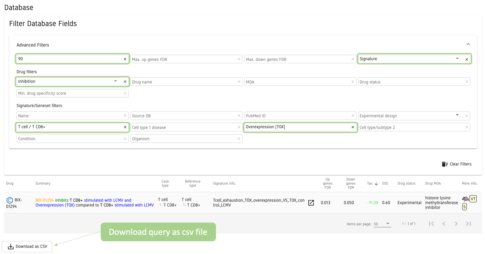
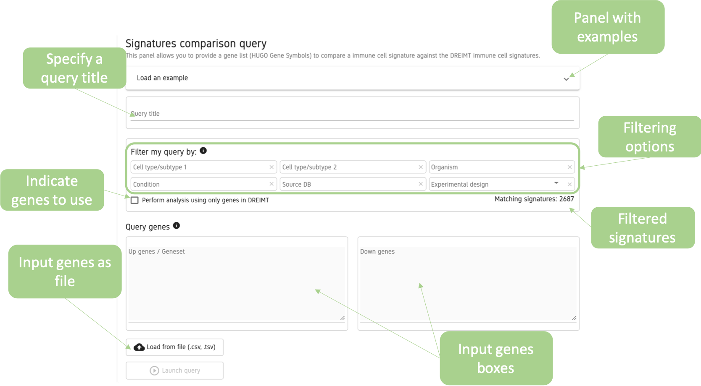

# DREIMT Help

Drug REpositioning for IMmune Transcritome
## Index
1. [What is DREIMT?](help#whats-dreimt)
    1. [How it works?](help#how)
    2. [Tools](help#modules)
2. [How to select drug candidates?](help#how-candidate)
    1. [TAU score](help#tau)
    2. [Drug specificity score](help#dss)
    3. [False discovery rate](help#fdr)
3. [Database](help#database)
    1. [Database fields](help#fields)
    2. [Database filtering](help#filtering)
    3. [Database example](help#query-db)
    4. [Complete database](help#query-full)
4. [Drug prioritization](help#Drug-prioritization)
    1. [Input](help#queries-input)
    2. [Options](help#queries-options)
    3. [Output](help#queries-output)
    4. [Query example](help#query-query)
5. [Signature comparison](help#comparison)
6. [FAQS](help#faqs)
    1. [Drugs in DREIMT](help#f1)
    2. [Signatures in DREIMT](help#f2)
    3. [Specificity sign](help#f3)
    4. [Prioritization score change](help#f4)
    5. [Thing](help#f5)
    6. [Code](help#f6)
    7. [Questions](help#f7)

## 1. What is DREIMT?

DREIMT is a bioinformatics tool for **hypothesis generation** and prioritization of **drugs capable of modulating immune cells activity**. DREIMT aims to repurpose drugs capable of modulating immune cells from transcriptomics data.

DREIMT integrates **4,690 drug profiles** from The Library of Network-Based Cellular Signatures (LINCS) L1000 data set  and **2,700 manually curated immune gene expression signatures** from multiple sources.

#### 1.1 How it works?
DREIMT uses the rationale developed by the LINCS L1000 project (Subramanian et al. 2017) based in the use of geneset enrichment analysis (GSEA) methodologies to measure the similarity of gene expression signatures to a set of drug transcriptomics profiles. The GSEA score (ES) is then prioritized against a large set of ES to generate an association score (TAU) for each drug profile-immune signature pair.

This methodology is employed to create a prioritized drug association database for immune gene expression signatures and to prioritize drugs from user-provided immune expression signatures. Complete description of the methodology can be found the in supplementary material.

#### 1.2 Tools
DREIMT contains three tools accessible in the upper menu.

- **Drug prioritization**: designed to retrieve ranked drug associations employing as input custom immune gene expression signatures.
- **Signature comparison**: designed to measure the similarity between a custom immune gene expression signature and signatures in DREIMT database.
- **Database**: contains precalculated ranked drug associations for a set of 2,700 manually curated immune gene expression signatures retrieved from the literature.

DREIMT also contains three sections of interest.
- **Help**: detailed information and examples for the correct use of DREIMT.
- **REST API**: detailed information to use the REST API tool.
- **Queries history**: stored results for drug prioritization and signature comparison tools.

## 2. How to select drug candidates?
DREIMT offers three scores to rank and prioritize drug candidates.

#### 2.1 Drug prioritization score (Tau)
The Drug prioritization score (**Tau**) indicates the degree of specifity for a given drug profile-immune signature association pair compared to a large set drug-immune signatures associations pairs in DREIMT's database.

Tau score ranges from **-100 to 100**, extreme values, both positive and negative, are scores of high specificity. The Tau score measures:
- **i)** How high is a particular drug-immune gene expression association compared to the rest of association for a given drug.
- **ii)** How high is a particular drug-immune gene expression association compared to all the associations calculated for a given immune signature.

For an **initial search** of drug candidates **tau scores >|90|** are considered as strong hypotheses for the drug profile-immune signature associations. Tau score should be considered as the **primary score** to prioritize drug associations.

#### 2.2 Drug specificity score
The Drug specificity score (**DSS**) adapted from Hodos et al. (Hodos et al. 2018) summarizes the replicability of a given drug profile across multiple cancer cell lines. This score considers the case whether the response to a drug is cell-specific or on the contrary is comparable across cells.

DSS scores ranges from **0 to 1**, scores close to 1 indicate that the transcriptomic effect of a given drug is found to be akin all tested cancer cell lines in LINCS database, on the contrary, scores close to 0 indicate the drug effect has been observed to be more cancer cell line specific.

If multiple drugs are associated (tau score >|90|) with an immune expression signature, DSS can be used to prioritize drugs.

#### 2.3 False discovery rate
**FDR** (Benjamini Y. and Hochberg Y., 1995) are generated by GSEA to account for multiple hypothesis testing. Drug profile-immune gene expression signature associations with FDR <0.05 are considered statistically significant.

FDR values are not intended to be used as cut-off values, but to prioritize associations when multiple drugs are associated with a give signature. FDR values can be helpful to retrieve meaningful information from the drug profile-immune gene expression signature associations. When using a complete signature (composed by both the upregulated and downregulated genes), FDR values can indicate which of the two genesets accounts for the higher weight in the drug profile-immune gene expression signature association, thus helping with the interpretations of the results.

## 3. Database
DREIMT database (DREIMTdb) contains **precalculated drug associations** for nearly **2,700 manually curated immune gene expression signatures** retrieved from the literature and **4,690 drug profiles** from The Library of Network-Based Cellular Signatures (LINCS) L1000 data set.

By default the DREIMTdb does not display any result, for this the tool provides a group of filters that must be used.

DREIMTdb in its online version only contains drug profile-immune gene expression signature associations with tau > |90|.

#### 3.1 Database fields
The database contains multiple information fields.

- **Drug**: includes the common drug name and a link to PubChem. Hovering the mouse over will display a tooltip with the drug BROAD ID and genes target by the drug.
- **Summary**: summarized sentence that includes relevant manually annotated information to ease with drug association interpretation.  
- **Case type**: cell type/cell subtype used as case for gene expression signature generation. If cell type and cell subtype names match, only cell subtype name is shown.
- **Reference type**: cell type/cell subtype used as reference for gene expression signature generation. If cell type and cell subtype names match, only cell subtype name is shown.
- **Signature info**: includes the source name given to the immune signature and a pop-up panel with signature related links to: signature source database, DREIMTdb summarized results and NCBI data generation publication.
- **Up genes FDR**: adjusted p-value for the upregulated geneset.
- **Down genes FDR**: adjusted p-value for the downregulated geneset.
- **Tau**: drug prioritization score, range (-100, 100).
- **DSS**: drug specificity score for those drugs with DSS available, range (0, 1).
- **Drug status**: current known status of drug (approved, experimental or withdrawn).
- **Drug MOA**: mechanism of action the drug.
- **More info.**: symbolic signature related information of: organism source of the signature (*Homo sapiens*/*Mus musculus*), experimental design (in vitro, in vivo, ex vivo, patient, in silico) and signature treatment (signature, upregulated geneset, downregulated geneset and geneset).

Depicted: Drug fields (orange), immune signature fields (green), drug-signate association fields (blue) and fields with information tooltips (red asterisk).

#### 3.2 Database filtering
To query DREIMTdb two filters levels are available, the **basic** filters and the **advanced** filters.

Clicking over each filter box displays a panel with all available options. If a filter is applied, the rest of filters will automatically update to display only feasible options.

DREIMTdb results can be downloaded in csv format for queries with less than 1,000 results. For programmatical use of the database an API is available to be used.

##### 3.2.1 Basic filters
By default DREIMT allows querying the database using three basic filters.

- **Cell type/subtype 1**: filters drug associations by the specified immune cell type/cell subtype of interest.
- **Drug effect**: allows the specification of the modulatory effect of interest (boosting/inhibition) over the selected cell type. This filter is activated after a cell type has been specified in Cell type/subtype 1 filter.
- **Drug name**: filters associations made with the specific selected drug. This filter can be used both,  independently and jointly with the other two basic filters.

##### 3.2.1 Advanced filters
Clicking in the Advanced filters displays a panel of detailed filters that can be used to refine the query. Previously selected basic filters will be displayed in the advanced filters panel, unless are erased by pressing in the Clear Filters button.

Advanced filters are organized in three main categories.

##### Score filters
- **Min. tau (1)**: filters results by the absolute tau score.
- **Max. up genes FDR (2)**: sets a threshold FDR value for the upregulated geneset of the immune signature.
- **Max. down genes FDR (3)**: sets a threshold FDR value for the downregulated geneset of the immune signature.
- **Interaction type (4)**: sets the use given to the immune gene expression signature to calculate the drug association score: signature (uses the complete signature composed of the upregulated and downregulated genes), signature up (uses only the upregulated genes), signature down (uses only the downregulated genes), geneset (genes without specified direction).

##### Drug filters
- **Drug effect (1)**: (basic filter) specifies the modulatory effect of interest (boosting/inhibition) over the selected cell type. This filter is activated after a cell type has been specified in Cell type/subtype 1 filter.
- **Drug name (2)**: (basic filter) filters associations by the specified drug name.
- **MOA (3)**: filters associations by the specified mechanism of action of the drugs.
- **Drug status (4)**: filters by the specified status of the drug.
- **Min. drug specificity score (5)**: specifies the threshold value for the DSS.

##### Signature/Geneset filters
- **Name (1)**: filters by the source name of the immune signatures.
- **Source DB (2)**: filters by the database source of the immune signatures.
- **PubMed ID (3)**: filters by the PubMed ID source of the publication that generated the immune signature data.
- **Experimental design (4)**: filters by the experimental design of the immune signatures; patient, in vivo, in vitro, transfection, ex vivo or in silico.
- **Cell type/subtype 1 (5)**: (basic filter) selects associations in which the specified immune cell type/cell subtype is involved.
- **Cell type 1 disease (6)**: allows to filter by disease source of the Cell type/subtype 1. This filter is activated after a cell type has been specified in Cell type/subtype 1 filter.
- **Cell type 1 treatment (7)**: allows the filtering by perturbations applied to the selected Cell type/subtype 1. This filter is activated after a cell type has been specified in Cell type/subtype 1 filter.
- **Cell type/subtype 2 (8)**: allows to specify a second immune cell type involved in the generation of the immune signature. This filter can only be used after specifying Cell type 1. This filter is activated after a cell type has been specified in Cell type/subtype 1 filter.
- **Condition (9)**: allows filtering signatures in which the specified disease/treatment is involved.
- **Organism (10)**: selects organism source of the signature: *Homo sapiens*, *Mus musculus*.

#### 3.3 Database query example I
In this example we will perform a query to search for drugs with the potential to inhibiting the effect of **TOX overexpression** (exhaustion marker) **in T CD8+ cells**. For this example we are only interested in associations made with the complete immune signature (upregulated and downregulated genes)

##### Filters applied
- **Cell type/subtype 1**: T cell/ T CD8+.
- **Cell type 1 treatment**: Overexpression [TOX].
- **Effect**: inhibition.
- **Interaction type**: Signature.

This query yields a single result, **BIX-01294**, with a tau score of -91.08- Both genesets are statistically significant (upregulated: 0.014, downregulated: 0.043), which indicates that both genesets have been relevant for the association with the drug.

The mechanism of action of the drugs is annotated as a methyltransferase inhibitor, the current status indicated this drugs is annotated as experimental.

The icons in the More information field indicate that the immune cells are from *Mus musculs*, the experiment was performed *in vitro* and the full signature (up and downregulated genes) is being accounted for the drug association. The summary sentence indicates that this drugs might **inhibit** those **T CD8+ cells simulated with LCMV and with TOX overexpression compared to those T CD8+ cells stimulated with LCMV**.

This drug targets EHMT2 and EHMT1 (tooltip in the drug field), which are known to be related with CD8+ exhaustion (Birili et al., 2020) .

Clicking over the link in the Signature information field displays a panel with three useful inks.  

- **PubMed**: a link to the publication that generated the expression data.
- **DREIMT Query**: summarized results for the selected signature.
- **Signature source**: a link to the source of the immune signature, in cases where the signature has been obtained from the Literature and not from a database this will link to the original paper.

By selecting the **DREIMT Query** option a new page with detailed information for the current signature (Tcell_exhaustion_TOX_overexpression_VS_TOX_control_LCMV) will be displayed.

This page displays three plots and a table.
- **Drug prioritization plot (1)**: plot representing all drugs associated (tau > |90|) with the immune signature. The x-axis represents the tau score and y-axis the -log10(FDR).

 Two areas of interest are depicted:
 - **Best candidates**: associations with high |tau| and statistically significant FDR (FDR < 0.05).
 - **Good candidates**: associations with high |tau| but no statistically significant FDR (FDR < 0.05).

 By default all associations are represented:
 - **Circles**: drug associations using the complete signature (up and down genes)
 - **Upright triangles**: drug associations performed using only the upregulated genes.
 - **Upside triangles**: drug associations performed using only the downregulated geneset.

 Associations can be added or removed by pressing in the corresponding legend icon.

- **Drugs by approval status (2)**: pie-chart representing the status of drugs associated with the immune signature.
- **Drugs by MOA (3)**: pie-chart representing the mode of action of drugs associated with the immune signature.
- **Drug predictions table (4)**: summarized database with associations for the specified immune signature. Filters applied to this table will update the plots.

Plots can be downloaded in multiple formats (png, jpeg, pdf and svg) using the download buttons. Hovering the mouse over the the plots will display tooltips with detailed information.

#### 3.3 Database example II
This example will perform a query to search for approved drugs that could potentially shift human macrophage cells polarization towards macrophage M1 phenotype instead of macrophage M2 phenotype.

This query can be performed in two ways with identical results.

##### Filters applied, option I
- **Cell type/subtype 1**: Macrophage/Macrophage M1.
- **Cell type/subtype 2**: Macrophage/Macrophage M2.
- **Organism**: *Homo sapiens*.
- **Effect**: Boosting.
- **Drug status**: Approved.

As the drug effect filter works over the specified cell in **Cell type/subtype 1** (Macrophage M1) and we are interested in drugs with the potential of boosting M1 phenotype the **Drug effect** filter should be specified with the boosting option.

##### Filters applied, option II
- **Cell type/subtype 1**: Macrophage/Macrophage M2.
- **Cell type/subtype 2**: Macrophage/Macrophage M1.
- **Organism**: *Homo sapiens*.
- **Effect**: Inhibition.
- **Drug status**: Approved.

In this case the **Cell type/subtype 1** specified corresponds to M2 phenotype macrophages which we intend to inhibit, for this reason the **Drug effect** filter should be specified with the inhibition option.

Both queries yield the same results, seven drugs that potentially could inhibit the M2 phenotype/boosting M1 phenotype polarization.

#### 3.4 Database example III

## 4.  Drug prioritization
This tool prioritizes drug associations from user-provided gene expression signatures and genesets against DREIMTdb stored drug profiles. Genes are required to in **gene symbol** format.

#### 4.1 Input

- **Query title**: (optional) name given to the query. This name will be used to store the results of the query in the Queries history panel.
- **Case type**: (optional) A brief description of the case immune cell used to generate the signature. This is use to create a summary sentence to help with the results interpretation.
- **Reference type**: (optional) A brief description of the reference immune cell used to generate the signature. This is use to create a summary sentence to help with the results interpretation.

Genes can be provided directly to the text box as a **list of genes** or uploading them in a **csv/tsv** format file. Genesets must contain a **minimum of 15** and a **maximum  of 200 genes** matching the **12,434 genes in the drug profiles**, otherwise the tool will indicate an error and the analysis will not be performed.

This tool only accepts a single query at time, each query requires its own separate input.

#### Input file (csv/tsv)
The input file can either be a **one or two columns** csv/tsv file. Files with more than two columns will not be processed and an error message will be displayed.

- **One column**: for single geneset queries such: upregulated geneset, downregulated geneset or a geneset without specified direction.
- **Two columns**: for complete signatures (upregulated and downregulated geneset).

The **header** of the **csv/tsv** file must contain a specific descriptor that allows DREIMT to correctly interpretate the input being queried.

Headers required:
- **Genes_UP**: specifies that the column contains upregulated genes.
- **Genes_DN**: specifies that the column contains downregulated genes.
- **Genes**: indicates that the column contains genes without a specific direction.

Examples of the top rows of the four possible csv inputs.

#### Input text box
Genes can be introduced to their corresponding text boxes as a single line (whitespaces or tab separated) or in multiple lines (one gene per line).

#### 4.2 Options
Once the analysis has been performed the output can be saved by downloading a the table in a comma separated format file or by saving the web-link which will be available for **XXXXX TIME**. The queries will also stored By clicking over query parameters a drop down table will show up with the following parameters:

#### 4.3 Ouput
This tool generates a table with the specificity score and FDR for the query signature against all drugs in database. Predictions can be filtered to prioritize drug and generate hypothesis for drugs to modulate the immune query. The output table can be downloaded in a comma separated file.

#### 4.4 Query example
XXXXX Imagenes

XXXXX Ejemplo query, explicar A vs B XXXXX

XXXXX

## 5. Signature comparison
This tool performs a Fisher's exact test and a Jaccard index analysis to compare a user-provided gene expression signature or genesets against signatures stored in DREIMTdb. DREIMTdb signatures are ranked by Jaccard index and can be queried for drug prioritizatied associations.

#### 5.1 Input
- **Query title**: (optional) name given to the query. This name will be used to store the results of the query in the Queries history panel.
- **Filters my query by**: (optional) filters DREIMTdb signatures  to compare against user-provided signature.
- **Perform analysis using only genes in DREIMT**: (optional) specifies the genes used to perform comparison analysis. If marked, only those genes in DREIMTdb drug profiles will be used to compare user-provided signature to DREIMTdb signatures, contrary, if this option is not marked all genes will be used to compare user-provided signature to DREIMTdb signatures.

Genes can be provided directly to the text box as a **list of genes** or uploaded in a **csv/tsv** format file. Genesets must contain a **minimum of 15** and a **maximum  of 200 genes** , otherwise the tool will indicate an error and the analysis will not be performed.

This tool only accepts a single query at time, each query requires its own separate input.

#### Input file (csv/tsv)
The input file can either be a **one or two columns** csv/tsv file. Files with more than two columns will not be processed and an error message will be displayed.

- **One column**: for single geneset queries such: upregulated geneset, downregulated geneset or a geneset without specified direction.
- **Two columns**: for complete signatures (upregulated and downregulated geneset).

The **header** of the **csv/tsv** file must contain a specific descriptor that allows DREIMT to correctly interpretate the input being queried.

Headers required:
- **Genes_UP**: specifies that the column contains upregulated genes.
- **Genes_DN**: specifies that the column contains downregulated genes.
- **Genes**: indicates that the column contains genes without a specific direction.

Examples of the top rows of the four possible csv inputs.

#### Input text box
Genes can be introduced to their corresponding text boxes as a single line (whitespaces or tab separated) or in multiple lines (one gene per line).

#### 3.3 Signature comparison example I
In this example we are performing a comparison between a user-provided signature against all DREIMTdb signatures. For demostration purposes the upregulated geneset has been introduced in a single row with genes separated by tabs and the downregulated geneset in a single column format.

#### 3.3 Signature comparison example II
In this this example we have narrowed our comparison to a specific set of DREIMTdb signatures. In this case the user-provided input is a downregulated geneset. The comparison is being perform against DREIMTdb signatures annotated as derived from the comparison of human macrophages stimulated with IL6.

##### Filters applied
-**Cell type/subtype 1**: Macrophage.
-**Cell type/subtype 2**: Macrophage.
-**Organism**: *Homo sapiens*.
-**Condition**: IL6.

## 7. FAQs
#### 7.1 Drugs in DREIMT
DREIMTdb contains 4,690 different drug profiles of which 3,580 correspond to unique compounds. Duplicated drugs correspond to compounds with different BROAD ID. Because of this, duplicated drugs in DREIMTdb might show different, even opposite tau scores for the same immune signature.

#### 7.2 Prioritization score change
Small changes in tau prioritization score can occur after a database update. DREIMTdb prioritizes drug based using all associations, adding new signatures or drugs can produce small changes in tau scores. For the same reason small changes can occur to FDR values.

#### 7.3 Signatures out of the required range
Drug profiles in DREIMTdb are composed by a ranked list of ~12,000 genes as measured by the LINCS. In order to perform the drug association analysis 15 to 200 immune gene expression signature genes are required to match with drug profile genes. If the user-derived signature is composed by more than 200 we suggest to delimit the query to top 200 genes more significant genes or to those with highest fold change. In case the the signature is composed by less than 15 genes try to include more genes if possible.

#### 7.6 Code
Scripts to generate drug predictions locally can be downloaded from the [repository](https://gitlab.com/ktroule/dreimt) and docker images [docker]().
#### 7.6 Questions
If after reading this help manual there still doubts you can write to XXXX@XXXX.com and we will add it.
